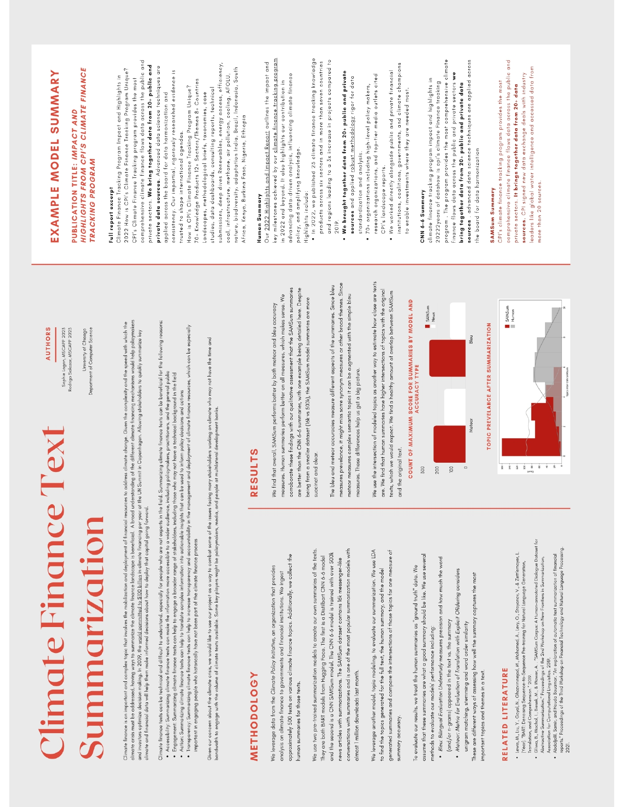

# Climate Texts Summarization

## Models
- Human summaries (ground truth) 
- Distilbart CNN 6-6 
- CNN Sam Sum

## Evaluation Methods 
- Rouge
- Bleu 
- Gleu
- Meteor
- Information gain (perplexity)

### Data
- Sources 
  - Climate Policy Initiative (CPI), a top climate finance analysis organization
    - Full report texts 
    - Human generated summaries (ground truth)
- Technique 
  - Web scraping

